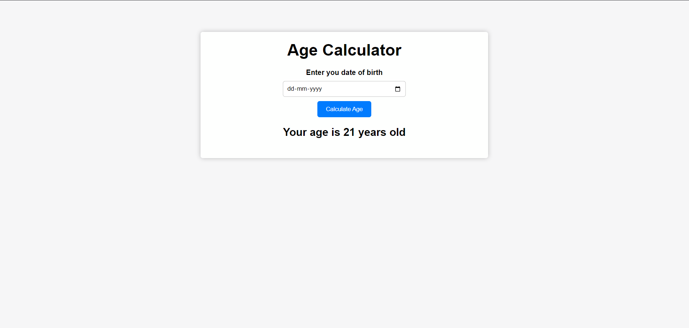

# Age Calculator

A simple age calculator web application built with HTML, CSS, and JavaScript. Users can enter their date of birth, and the app will calculate and display their current age in years.

## Features

- Users can input their date of birth using a date picker.
- The application calculates the user's age and displays it on the screen.
- Responsive design: works well on desktop, tablet, and mobile devices.

## Live Demo

[Link to the live demo](#) (If you have hosted your project, you can add a link here)

## Technologies Used

- **HTML5**: Structure of the webpage
- **CSS3**: Styling and responsive design
- **JavaScript**: Handling the age calculation logic and DOM manipulation

## Getting Started

### Prerequisites

To run the project locally, you only need a web browser.

### Installation

1. Clone the repository or download the ZIP file:
   ```bash
   git clone https://github.com/your-username/age-calculator.git

2. Navigate to the project directory:
    ```bash
   cd age-calculator

3. Open the index.html file in your browser to run the application.

## Usage

1. Enter your date of birth in the provided input field.
2. Click the Calculate Age button.
3. Your age will be displayed below the button.

## Project Structure
    ```bash
    age-calculator/
    │
    ├── index.html      # Main HTML file
    ├── style.css       # CSS file for styling
    ├── media.css       # CSS file for responsive design (media queries)
    ├── script.js       # JavaScript file for age calculation logic
    └── README.md       # Project description and instructions


## Screenshots
**Here is a screenshot of the application:**

1. In laptop

   

2. In Tablet

   

3. In Mobile

   

## Contact

If you have any questions, feel free to contact me at ajeetrana520@gmail.com.


